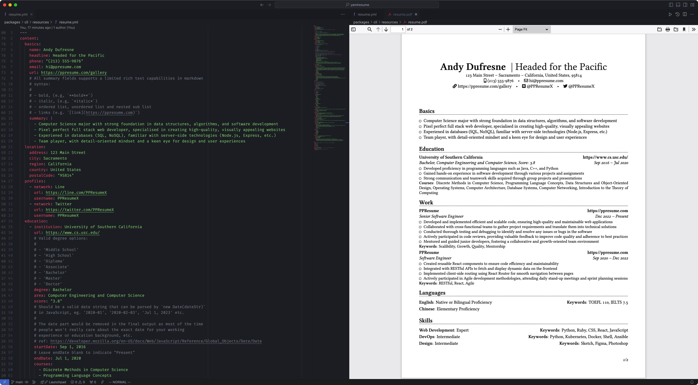
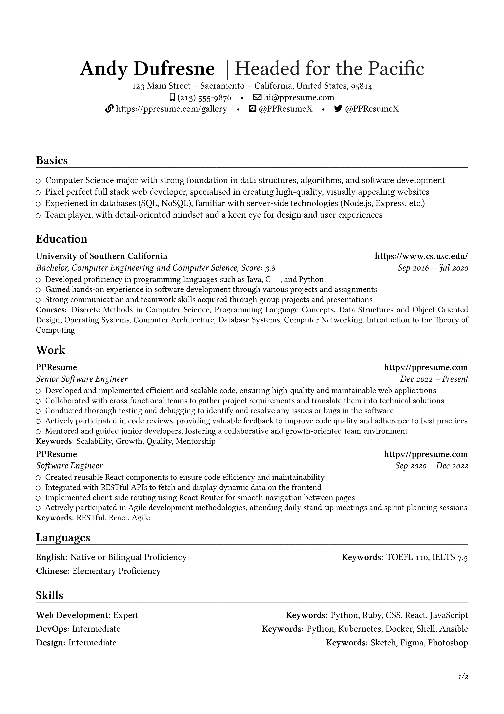
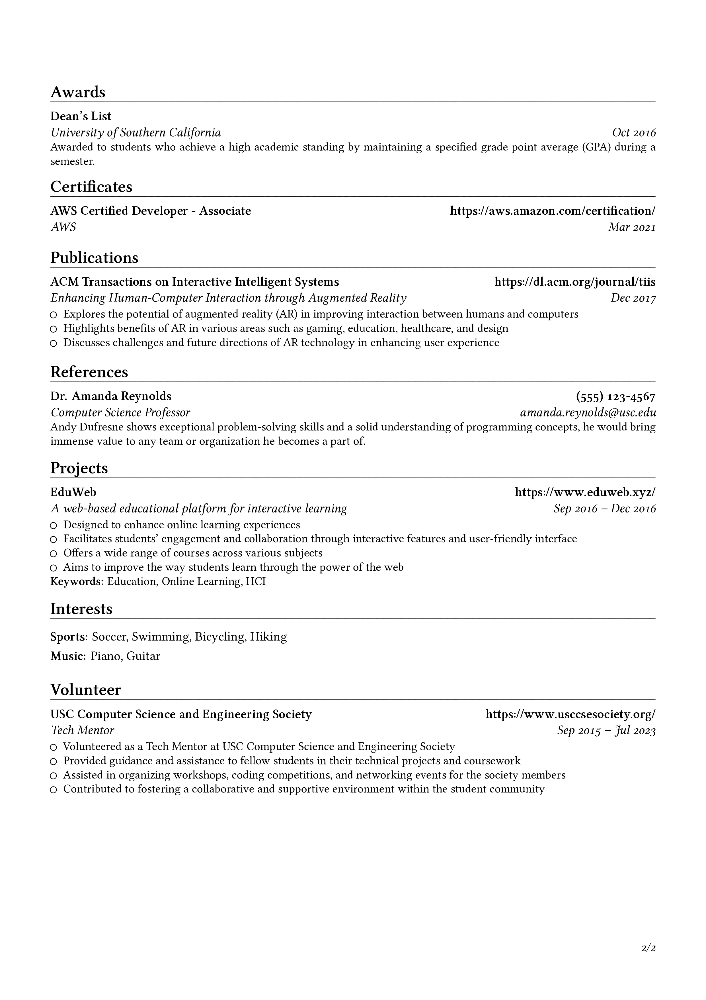

# YAMLResume

[Français](./README-fr.md) | [日本語](./README-ja.md) | [简体中文](./README-zh-cn.md) | [繁體中文](./README-zh-tw.md)

<!-- Build, Quality & Docs -->
[](https://github.com/yamlresume/yamlresume/actions/workflows/test.yml)
[](https://codecov.io/gh/yamlresume/yamlresume)
[](https://github.com/yamlresume/yamlresume/security)
[](https://yamlresume.dev)
[](https://discord.gg/9SyT7mVV4K)

<!-- Package & Distribution -->
[](https://nodejs.org/)
[](https://www.npmjs.com/package/yamlresume)
[](https://www.npmjs.com/package/yamlresume)
[](https://hub.docker.com/r/yamlresume/yamlresume)
[](https://hub.docker.com/r/yamlresume/yamlresume)

<!-- Technology Stack -->
[](https://www.latex-project.org/)
[](https://www.typescriptlang.org/)
[](https://pnpm.io/)
[](https://conventionalcommits.org)
[](https://biomejs.dev/)
[](https://vitest.dev/)


Writing resumes may not be hard, but it is definitely not fun and it's tedious.

[YAMLResume](https://yamlresume.dev) allows you to manage and version control
your resumes using [YAML](https://yaml.org/) and makes generating professional looking PDFs with beautiful typesetting a breeze.



## The Design Principle

This project started as the core typesetting engine for
[PPResume](https://ppresume.com/?ref=yamlresume), a LaTeX based, pixel perfect
resume builder. After careful consideration, we decided to open source it so
people can always have the right to say [no to vendor
lock-in](https://blog.ppresume.com/posts/no-vendor-lock-in).

The core design principle behind YAMLResume is [Separation of
Concerns](https://en.wikipedia.org/wiki/Separation_of_concerns). One of the
best-known examples of this principle is HTML and CSS, which form the foundation
of the modern web. HTML defines webpage content, and CSS styles that content.

Following this principle, we designed YAMLResume with the following requirements
in mind:

- the resume content is drafted in plain text
- the plain text is structured using YAML—YAML is better than JSON because it is
  more human-readable and human-writable
- the YAML plain text is then rendered into a PDF with a pluggable typesetting
  engine
- the layout can be adjusted with options like font sizes, page margins, etc.

## Quick Start

If you have Docker installed, you can get started with `yamlresume` in one
second, this package includes `yamlresume` and all of its dependencies:

[](https://asciinema.org/a/722057)

Alternatively, you can install `yamlresume` using your favorite package
manager:

```
# NPM
$ npm install -g yamlresume

# Yarn
$ yarn global add yamlresume

# pnpm
$ pnpm add -g yamlresume

# Bun
$ bun add -g yamlresume

# Homebrew
$ brew install yamlresume
```

Verify that `yamlresume` installed successfully:

```
$ yamlresume help
Usage: yamlresume [options] [command]

YAMLResume — Resume as Code in YAML

 __   __ _    __  __ _     ____
 \ \ / // \  |  \/  | |   |  _ \ ___  ___ _   _ ___  ___   ___
  \ V // _ \ | |\/| | |   | |_) / _ \/ __| | | / _ \/ _ \ / _ \
   | |/ ___ \| |  | | |___|  _ <  __/\__ \ |_| | | | | | |  __/
   |_/_/   \_\_|  |_|_____|_| \_\___||___/\____|_| |_| |_|\___|


Options:
  -V, --version                  output the version number
  -v, --verbose                  verbose output
  -h, --help                     display help for command

Commands:
  new [filename]                 create a new resume
  build [options] <resume-path>  build a resume to LaTeX and PDF
  dev [options] <resume-path>    build a resume on file changes (watch mode)
  languages                      i18n and l10n support
  templates                      manage resume templates
  validate <resume-path>         validate a resume against the YAMLResume schema
  help [command]                 display help for command
```

You then need to install a typesetting engine, either
[XeTeX](http://yamlresume.dev/docs#install-typesetting-engine) or
[Tectonic](http://yamlresume.dev/docs#install-typesetting-engine) in order to
generate PDFs.

Last but not least, we recommend you install the [Linux
Libertine](http://yamlresume.dev/docs#linux-libertine-font) font in
order to get the best looking PDFs.

Check out our [installation guide](http://yamlresume.dev/docs/installation) for
more details.

## Create a new resume

You can create your own resume by cloning one of our sample resumes
[here](./packages/cli/src/commands/fixtures/software-engineer.yml). Once you
have the sample resume on your computer, you can generate a PDF with:

```
$ yamlresume new my-resume.yml
✔ Created my-resume.yml successfully.

$ yamlresume build my-resume.yml
◐ Generating resume PDF with command: xelatex -halt-on-error my-resume.tex...
✔ Generated resume PDF file successfully.
```

You can also use the [`dev` command](https://yamlresume.dev/docs/cli#dev) to
rebuild the resume on each file change, which provides **a modern web
development-like experience**:

```
$ yamlresume dev my-resume.yml
◐ Generating resume PDF file with command: xelatex -halt-on-error my-resume.tex...
✔ Generated resume PDF file successfully.
◐ Watching file changes: my-resume.yml...
```

Check out the generated PDF [here](./docs/static/images/resume.pdf).




[PPResume Gallery](https://ppresume.com/gallery/?ref=yamlresume) provides a
showcase of all the possible types of resumes, categorized by languages and
templates.

## Validating resumes

YAMLResume provides a builtin
[schema](https://yamlresume.dev/docs/compiler/schema) which you can use to
validate resumes and avoid low level mistakes. Check out the following demo to
see it in action:

[](https://asciinema.org/a/728098)

## Typesetting

YAMLResume uses [LaTeX](https://www.latex-project.org/) as its default
typesetting engine, which is the state of the art typesetting system in the
academic and technical publishing industry.

By following a series of [best
practices](https://docs.ppresume.com/guide?ref=yamlresume), YAMLResume always
guarantees you **Pixel Perfect** resumes.

In the future we may support other typesetting engines like
[Typst](https://github.com/typst/typst), HTML/CSS, etc.

## Ecosystem

YAMLResume provides a set of tools to help you create, convert, and manage your
resumes more efficiently. These tools include:

- [create-yamlresume](https://yamlresume.dev/docs/ecosystem/create-yamlresume)
  makes it easy to start a new YAMLResume project with one command. It
  will scaffold your project directory, install necessary dependencies, and
  generates a sample resume file so you can get started right away. Try it with
  `npx create-yamlresume my-resume` or similar commands for `npm`, `yarn`,
  `pnpm` or `bun`.
- [json2yamlresume](https://yamlresume.dev/docs/ecosystem/json2yamlresume) is a
  CLI tool for converting [JSON Resume](https://jsonresume.org/) files to the
  native format for YAMLResume.

## Contributing

This project is still under active development and we are constantly working on
new features and bug fixes. The public API is not stable yet, so please be
patient.

Contributions are deeply appreciated! Please read the
[guidelines](./CONTRIBUTING.md) before submitting a pull request.

### Star History

[](https://www.star-history.com/#yamlresume/yamlresume&Date)

## Roadmap

- [ ] support more font families
- [ ] more resume templates
- [ ] more locale languages

## Support the Project

If you find YAMLResume helpful, please consider supporting the project:

[](https://buymeacoffee.com/xiaohanyu)
