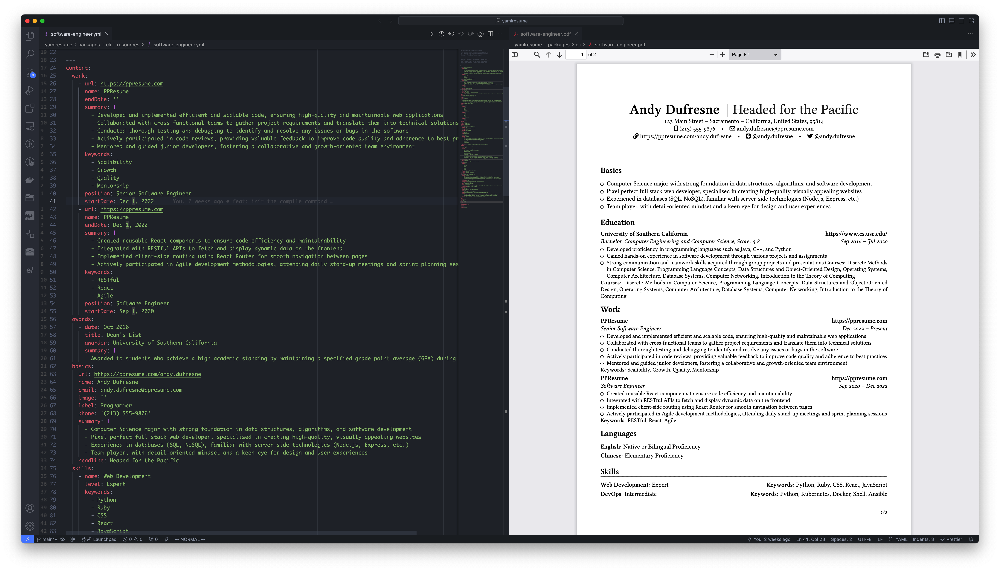

# YAMLResume

Writing resumes may not be hard, but it is definitely not fun and tedious.

YAMLResume allows you to manage and version control your resumes using
[YAML](https://yaml.org/) and generate professional looking PDFs with beautiful
typesetting in a breeze.



## The Design Principle

This project was started as the core typesetting engine for
[PPResume](https://ppresume.com/?ref=yamlresume), a LaTeX based, pixel perfect
resume builder.  After careful consideration, we decided to open source it so
people can always have the right to say [no to vendor
lock-in](https://blog.ppresume.com/posts/no-vendor-lock-in).

The core design principle of YAMLResume is [Separation of
Concerns](https://en.wikipedia.org/wiki/Separation_of_concerns). One of the most
famous examples that follows this principle is HTML & CSS, which are the
foundation of the modern web—HTML is used for organization of webpage content,
CSS is used for definition of content presentation style.

Following the core principle, YAMLResume is implemented by satisfying the
following requirements:

- the resume content is drafted in plain text
- the plain text is structured using YAML—YAML is better than JSON because it is
  more human-readable and human-writable
- the YAML plain text is then rendered into a PDF with a pluggable typesetting
  engine
- the layout can be adjusted with options like font sizes, page margins, etc.

## Getting Started

### Typesetting Engine

#### XeTeX

YAMLResume use [XeTeX](https://tug.org/xetex/) as the typesetting engine for
generating the PDF, so you have to install it first. Different operating systems
have different ways to install XeTeX:

- **macOS:** The easiest way is to install the **MacTeX** distribution. It
  includes XeTeX along with many other TeX-related programs and packages. You
  can download it from the [MacTeX website](https://www.tug.org/mactex/).
- **Windows:**
  - Install the **MiKTeX** distribution. It's a popular choice for Windows and
    includes XeTeX. You can download it from the [MiKTeX
    website](https://miktex.org/download).
  - Alternatively, you can install **TeX Live** for Windows, which also includes
    XeTeX. Download it from the [TeX Live
    website](https://www.tug.org/texlive/acquire-netinstall.html).
- **Linux:**
  - Most Linux distributions offer TeX Live through their package managers.
    XeTeX is typically included in the `texlive-xetex` package or a larger
    `texlive-full` meta-package.
  - Let's take **Debian/Ubuntu:** for an example here:
    ```bash
    sudo apt update
    sudo apt install texlive-xetex
    # Or for a full installation:
    # sudo apt install texlive-full
    ```
  - Alternatively, you can install TeX Live directly from the [TeX Live
    website](https://www.tug.org/texlive/acquire-netinstall.html) using their
    installer, which works across different Linux distributions.

After installing one of these distributions, the `xelatex` command should be
available in your terminal.

#### Tectonic

YAMLResume also supports
[Tectonic](https://tectonic-typesetting.github.io/en-US/), which is a
modernized, complete, self-contained
[TeX](https://en.wikipedia.org/wiki/TeX)/[LaTeX](https://www.latex-project.org/)
engine, powered by [XeTeX](https://tug.org/xetex/) and
[TeXLive](https://www.tug.org/texlive/).

Check the [installation
guide](https://tectonic-typesetting.github.io/book/latest/getting-started/install.html)
to get Tectonic installed on your operating system.

### Font

YAMLResume adopts [Linux Libertine](https://www.dafont.com/linux-libertine.font)
as the default font for latin characters. You need to install it on your system
before you can generate a PDF resume.

1. **macOS**

```bash
brew install font-linux-libertine
```

2. **Windows**
  - Download the latest version of [Linux
    Libertine](https://www.dafont.com/linux-libertine.font) from the website and
    extract the archive to a directory, e.g. `C:\Windows\Fonts`.

3. **Linux**
  - Let's take **Debian/Ubuntu** as an example here:
  ```bash
  sudo apt update
  sudo apt install fonts-linuxlibertine
  ```

If you need CJK resumes, you also need to install [google noto
fonts](https://fonts.google.com/noto/).

### Installation

Now it is time to install `yamlresume`:

```bash
# using npm
npm install -g yamlresume

# using yarn
yarn global add yamlresume

# using pnpm
pnpm add -g yamlresume
```

Verify `yamlresume` is installed successfully:

```
$ yamlresume help

Usage: yamlresume [options] [command]

YAMLResume — Resume as Code in YAML

 ____  ____  ____
|  _ \|  _ \|  _ \ ___  ___ _   _ _ __ ___   ___
| |_) | |_) | |_) / _ \/ __| | | | '_ ` _ \ / _ \
|  __/|  __/|  _ <  __/\__ \ |_| | | | | | |  __/
|_|   |_|   |_| \_\___||___/\__,_|_| |_| |_|\___|


Options:
  -V, --version     output the version number
  -h, --help        display help for command

Commands:
  build <source>    build a resume to LaTeX and PDF
  languages         i18n and l10n support
  templates         manage resume templates
  help [command]    display help for command
```

## Sample Resumes

You can create your own resume by cloning one of our sample resumes
[here](./packages/cli/resources/software-engineer.yml), so once you have the
sample resume on your local, you can get a pdf with:

```bash
yamlresume build software-engineer.yml
```

Check the generated PDF [here](./packages/cli/resources/software-engineer.pdf)

[PPResume Gallery](https://ppresume.com/gallery/?ref=yamlresume) provides a
showcase for all possible kind of resumes categoried by languages and templates.

More samples would come soon!

## VS JSON Resume

YAMLResume is inspired by [JSON Resume](https://jsonresume.org/), with some
notable differences:

- As the name explained, JSON Resume adopts JSON as the data format, while
  YAMLResume adopts YAML, the reason is self explanatory as mentioned earlier—
  YAML is more human-readable and human-writable.
- JSON Resume use some nested object structure, i.e `location` and `profiles`
  are nested under `basics` object, while YAML content object are all top level.
- JSON Resume do not specify anything about layout and typesetting, while
  YAMLResume provides builtin spec and implementation for layout and typesetting
  under `layout` object.
- JSON Resume supports a one line `summary` and a list of strings for
  `highlights`, while YAMLResume combines these two to one `summary` field with
  rich text support, so you can create paragraph, list, nested listed for
  `summary` field in any section
- `studyType` in JSON Resume's `education` section is renamed as `degree` in
  YAMLResume.
- `languages` section in YAMLResume supports `keywords` input.

We are going to offer a tool to import JSON Resume to YAMLResume in the future.

## Roadmap

- [ ] font selection in `layout`
- [ ] section alias
- [ ] section reordering
- [ ] section cloning
- [ ] more resume templates
- [ ] more locale languages