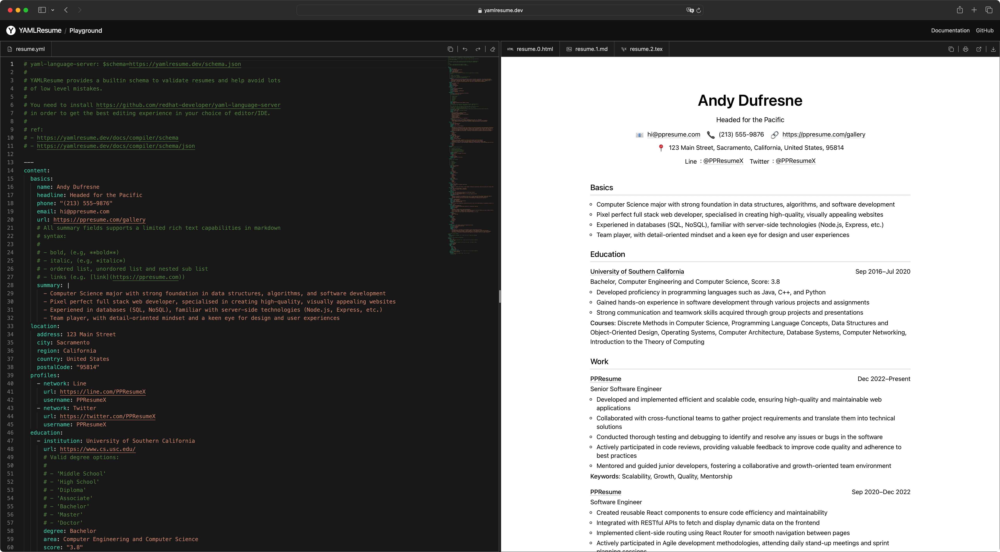
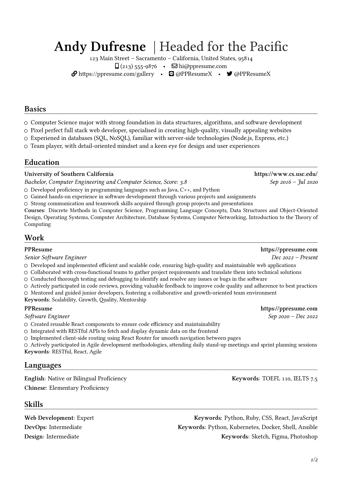
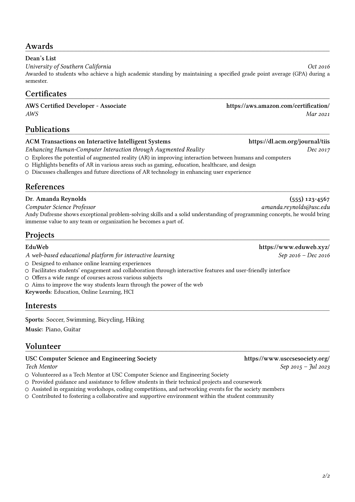
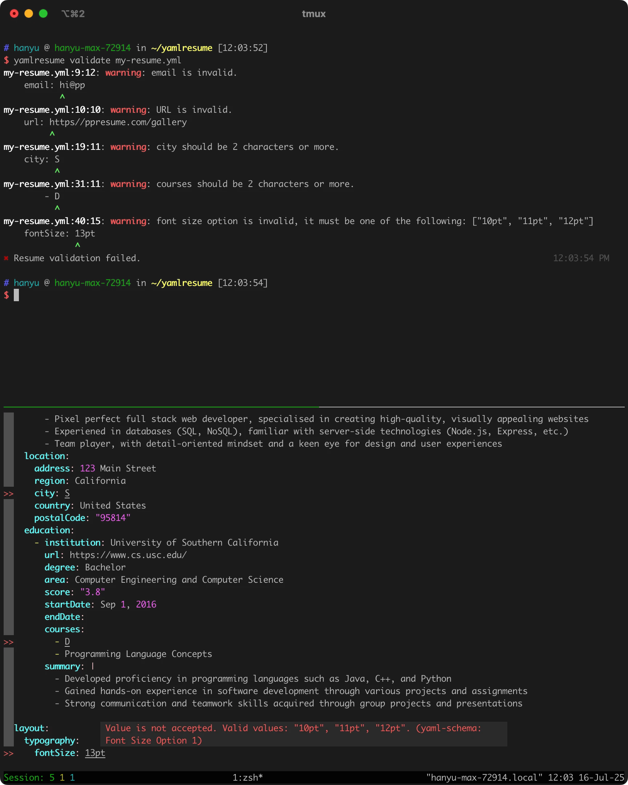
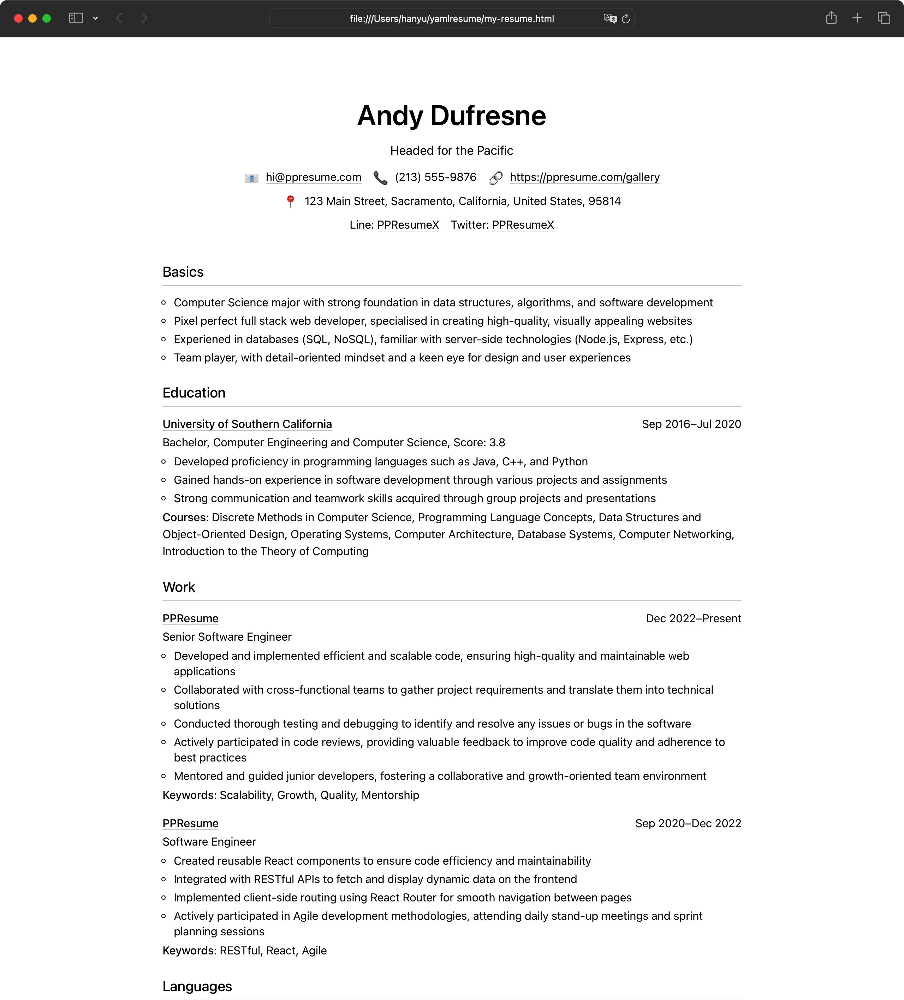
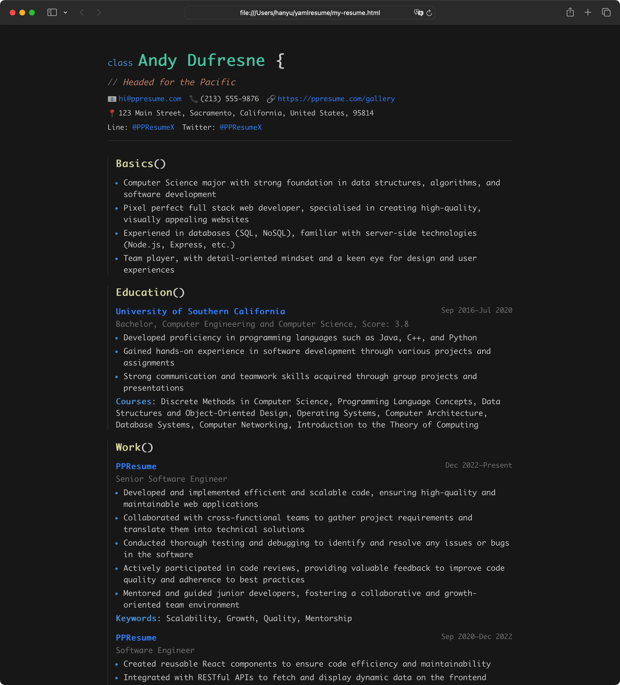
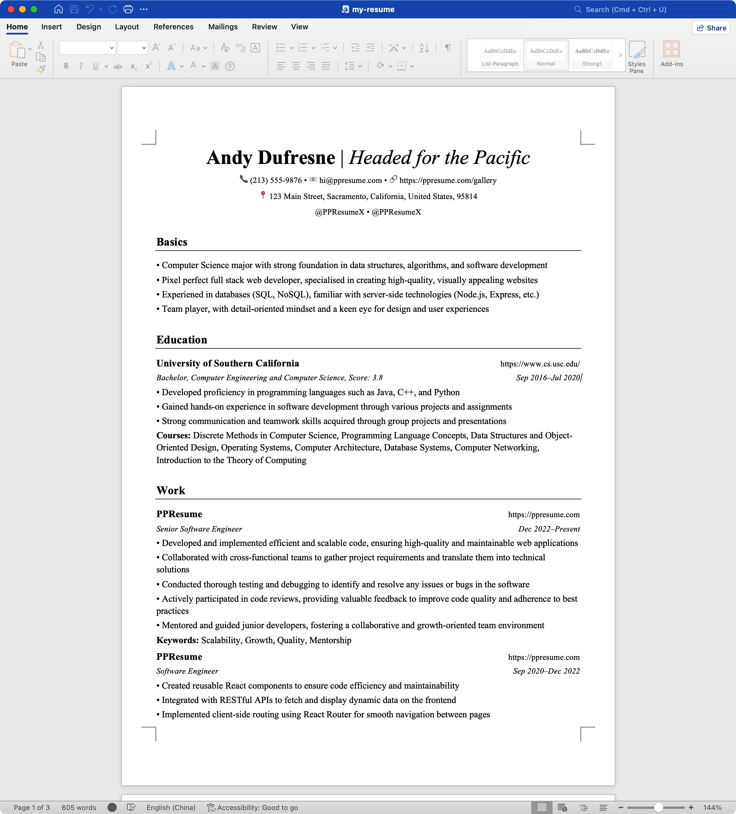

# YAMLResume

[English](./README.md) | [Français](./readmes/README-fr.md) |
[Deutsch](./readmes/README-de.md) | [Español](./readmes/README-es.md) |
[Português](./readmes/README-pt.md) | [Bahasa Indonesia](./readmes/README-id.md)
| [日本語](./readmes/README-ja.md) | [简体中文](./readmes/README-zh-cn.md) |
[繁體中文](./readmes/README-zh-tw.md)

<!-- Build, Quality & Docs -->

[](https://github.com/yamlresume/yamlresume/actions/workflows/test.yml)
[](https://yamlresume.dev)
[](https://discord.gg/9SyT7mVV4K)
[](https://codecov.io/gh/yamlresume/yamlresume)
[](https://github.com/yamlresume/yamlresume/security)
[](https://debuggix.space/verified)

<!-- Package & Distribution -->

[](https://nodejs.org/)
[](https://www.npmjs.com/package/yamlresume)
[](https://www.npmjs.com/package/yamlresume)
[](https://hub.docker.com/r/yamlresume/yamlresume)
[](https://hub.docker.com/r/yamlresume/yamlresume)

<!-- Technology Stack -->

[](https://www.latex-project.org/)
[](https://www.typescriptlang.org/)
[](https://pnpm.io/)
[](https://conventionalcommits.org)
[](https://biomejs.dev/)
[](https://vitest.dev/)

> **News:**
> [YAMLResume v0.15](https://github.com/yamlresume/yamlresume/releases) is out
> with curated sample resumes in 12 locales and AI-powered resume generation.
> Also check out the
> [YAMLResume GitHub Action](https://github.com/marketplace/actions/yamlresume)
> to automate PDF builds in CI/CD.

Writing resumes may not be hard, but it is definitely not fun and it's tedious.

[YAMLResume](https://yamlresume.dev) lets you manage and version-control your
resumes as plain-text [YAML](https://yaml.org/) and turn them into beautifully
typeset, professional documents with a single command.



## The Design Principle

This project started as the core typesetting engine for
[PPResume](https://ppresume.com/?ref=yamlresume), a LaTeX-based, pixel-perfect
resume builder. After careful consideration, we decided to open source it so
people can always say
[no to vendor lock-in](https://blog.ppresume.com/posts/no-vendor-lock-in).

YAMLResume follows
[Separation of Concerns](https://en.wikipedia.org/wiki/Separation_of_concerns):

- **Content** lives in plain-text YAML.
- **Structure and validation** are enforced by the compiler and a strict schema.
- **Presentation** is handled by pluggable layout engines (LaTeX, HTML,
  Markdown, DOCX).

You edit the what; YAMLResume handles the how.

## Features at a Glance

- **One source, multiple outputs.** From a single `resume.yml` generate
  pixel-perfect PDFs (via LaTeX), clean Markdown, responsive HTML, and Microsoft
  Word DOCX files.
- **A real resume compiler.** Parse, validate, transform, and render. Catch
  errors early with Zod runtime validation and JSON Schema editor integration.
- **Great developer experience.** Watch mode with `yamlresume dev`, environment
  diagnostics with `yamlresume doctor`, and instant schema validation.
- **AI-powered generation.** Bootstrap a complete resume from a job title and
  locale with `yamlresume ai generate`.
- **Flexible layouts.** Rename and reorder sections, switch templates, tune
  typography, paper size, line spacing, and toggle icons.
- **Global i18n.** Built-in support for 10 languages across 12 locale codes.
- **Rich ecosystem.** Docker image, Homebrew formula, GitHub Action, embeddable
  Playground, curated samples, and a JSON Resume converter.

## Quick Start

The fastest way to try YAMLResume is with Docker. The image ships with the CLI,
XeTeX, and recommended fonts:

```sh
docker run --rm -v $(pwd):/home/yamlresume yamlresume/yamlresume new my-resume.yml
docker run --rm -v $(pwd):/home/yamlresume yamlresume/yamlresume build my-resume.yml
```

[](https://asciinema.org/a/722057)

You can also install `yamlresume` with your favorite package manager (Node.js
>= 22 is required):

```sh
# npm
npm install -g yamlresume

# pnpm
pnpm add -g yamlresume

# yarn
yarn global add yamlresume

# bun
bun add -g yamlresume

# Homebrew (macOS)
brew install yamlresume
```

Verify the installation and check your environment:

```sh
yamlresume help
yamlresume doctor
```

For detailed installation steps, including how to set up a typesetting engine,
see the [installation guide](https://yamlresume.dev/docs/installation).

## Create a new resume

You can create your own resume by cloning one of our sample resumes
[here](./packages/cli/src/commands/fixtures/software-engineer.yml). Once you
have the sample resume on your computer, you can generate a PDF with:

```sh
$ yamlresume new my-resume.yml
✔ Created my-resume.yml successfully.

$ yamlresume build my-resume.yml
✔ Generated resume tex file successfully: my-resume.tex
◐ Generating resume pdf file with command: xelatex -halt-on-error my-resume.tex...
✔ Generated resume pdf file successfully: my-resume.pdf
✔ Generated resume docx file successfully: my-resume.docx
✔ Generated resume markdown file successfully: my-resume.md
✔ Generated resume html file successfully: my-resume.html
```

You can also use the [`dev` command](https://yamlresume.dev/docs/cli#dev) to
rebuild the resume on each file change, which provides **a modern web
development-like experience**:

```sh
$ yamlresume dev my-resume.yml
✔ Generated resume tex file successfully: my-resume.tex
◐ Generating resume pdf file with command: xelatex -halt-on-error my-resume.tex...
◐ Watching file changes: my-resume.yml...
✔ Generated resume pdf file successfully: my-resume.pdf
✔ Generated resume docx file successfully: my-resume.docx
✔ Generated resume markdown file successfully: my-resume.md
```

Check out the generated PDF [here](./docs/static/images/resume.pdf).




[PPResume Gallery](https://ppresume.com/gallery/?ref=yamlresume) provides a
showcase of all the possible types of resumes, categorized by languages and
templates.

## Multi-Layout Output

Layouts decouple your content from presentation. Add as many output formats as
you need in `resume.yml`:

```yml
layouts:
  - engine: latex
    template: moderncv-banking
    typography:
      fontSize: 11pt
  - engine: markdown
  - engine: html
    template: calm
  - engine: docx
    template: calm
```

Learn more about each engine:

- [LaTeX / PDF](https://yamlresume.dev/docs/layouts/latex)
- [HTML](https://yamlresume.dev/docs/layouts/html)
- [Markdown](https://yamlresume.dev/docs/layouts/markdown)
- [DOCX](https://yamlresume.dev/docs/layouts/docx)

## Watch Mode

Use `yamlresume dev` to rebuild your resume automatically as you edit the YAML
file:

```sh
yamlresume dev my-resume.yml
```

This gives you a tight feedback loop similar to modern web development: save the
file and the PDF updates moments later. You can pass `--no-pdf` or
`--no-validate` to speed things up during drafting.

## Validating Resumes

YAMLResume provides a built-in
[schema](https://yamlresume.dev/docs/compiler/schema) that validates your resume
before rendering. Add the schema header to your YAML file for IDE autocomplete,
hover documentation, and real-time format checks:

```yml
# yaml-language-server: $schema=https://yamlresume.dev/schema.json
```

Run `yamlresume validate my-resume.yml` for clang-style diagnostics:



## AI-Powered Resume Generation

New in v0.14, `yamlresume ai generate` creates a complete, schema-valid resume
from a position and language:

```sh
export OPENAI_API_KEY=sk-...
yamlresume ai generate --position "Software Engineer" --language en resume.yml
```

Supported providers include OpenAI, DeepSeek, Kimi, and Ollama. Read the
[AI documentation](https://yamlresume.dev/docs/ai) for setup details.

## Templates

YAMLResume ships with a growing set of templates across engines:

| Engine | Templates                                                         |
| ------ | ----------------------------------------------------------------- |
| LaTeX  | `moderncv-banking`, `moderncv-casual`, `moderncv-classic`, `jake` |
| HTML   | `calm`, `vscode`                                                  |
| DOCX   | `calm`                                                            |

Run `yamlresume templates list` to see everything that is installed.





## Languages

YAMLResume supports localization out of the box. Set your locale in
`resume.yml`:

```yml
locale:
  language: en
```

Supported languages include English, Chinese (Simplified, Traditional TW/HK),
Spanish, French, Norwegian, Dutch, Japanese, German, Indonesian, and Brazilian
Portuguese. See the [locale docs](https://yamlresume.dev/docs/locale) for the
full list.

## Ecosystem

YAMLResume provides a set of tools to help you create, convert, and manage your
resumes more efficiently:

- [`@yamlresume/ai`](https://www.npmjs.com/package/@yamlresume/ai) —
  Programmatic AI-powered resume generation.
- [`@yamlresume/playground`](https://www.npmjs.com/package/@yamlresume/playground)
  — Embeddable React component for building your own resume editor. It powers
  the official [Playground](https://yamlresume.dev/playground).
- [`@yamlresume/samples`](https://www.npmjs.com/package/@yamlresume/samples) —
  Curated sample resumes for common positions in 12 locales.
- [`yamlresume/action`](https://github.com/marketplace/actions/yamlresume) —
  GitHub Action for automating resume builds in CI/CD.
- [`create-yamlresume`](https://yamlresume.dev/docs/ecosystem/create-yamlresume)
  — Scaffold a new YAMLResume project with one command.
- [`json2yamlresume`](https://yamlresume.dev/docs/ecosystem/json2yamlresume) —
  Convert [JSON Resume](https://jsonresume.org/) files to YAMLResume format.
- [Docker image](https://hub.docker.com/r/yamlresume/yamlresume) and
  [Homebrew formula](https://formulae.brew.sh/formula/yamlresume) for easy
  installation.

## Contributing

YAMLResume is under active development and new features land regularly.
Contributions are deeply appreciated. Please read the
[guidelines](./CONTRIBUTING.md) before submitting a pull request.

### Star History

[](https://star-history.dera.page/#yamlresume/yamlresume&Date)

## Roadmap

- [ ] more resume templates
- [ ] more layout engines (typst, and others)
- [ ] more languages and locales
- [ ] ATS optimization features

## Support the Project

If you find YAMLResume helpful, please consider supporting the project:

[](https://buymeacoffee.com/xiaohanyu)


## 🌐 Web Resources & Aesthetic Symbols Index
- [HEAVY HEART EXCLAMATION](https://pearl-girly-fonts-86.pages.dev/symbol/heavy-heart-exclamation/)
- [SYM 2742](https://kawaii-kaomoji-hub-80.pages.dev/symbol/sym-2742/)
- [CYBER PHANTOM GLYPH](https://minimal-star-symbols-25.pages.dev/symbol/cyber-phantom-glyph/)
- [SYM 26F3](https://angelic-bow-symbols-42.pages.dev/symbol/sym-26f3/)
- [CLOUD WEATHER SYMBOL](https://matrix-hacker-text-52.pages.dev/symbol/cloud-weather-symbol/)
- [SYM 26D2](https://theeduplaycampen.pages.dev/symbol/sym-26d2/)
- [SYM 26F7](https://ribbon-heart-fonts-86.pages.dev/symbol/sym-26f7/)
- [SYM 1D438](https://nordic-minimal-fonts-67.pages.dev/symbol/sym-1d438/)
- [SYM 2610](https://gothic-bio-fonts-13.pages.dev/symbol/sym-2610/)
- [SYM 1D41B](https://pastel-moe-emoticons-80.pages.dev/symbol/sym-1d41b/)
- [SYM 2639](https://nordic-minimal-fonts-67.pages.dev/symbol/sym-2639/)
- [BLACK STAR](https://gothic-bio-fonts-86.pages.dev/symbol/black-star/)
- [FREEFIRE NAMES](https://vintage-library-rune-80.pages.dev/ru/freefire-names/)
- [SYM 1D424](https://sleek-bio-symbols-51.pages.dev/symbol/sym-1d424/)
- [BRACKETS](https://sleek-bio-symbols-51.pages.dev/vi/brackets/)
- [SYM 1D40D](https://matrix-glitch-text-37.pages.dev/symbol/sym-1d40d/)
- [SYM 2637](https://matrix-glitch-text-37.pages.dev/symbol/sym-2637/)
- [SYM 2663](https://coquette-symbols.pages.dev/symbol/sym-2663/)
- [DISCORD STATUS](https://coquette-symbols.pages.dev/vi/discord-status/)
- [SYM 26CE](https://nordic-minimal-fonts-67.pages.dev/symbol/sym-26ce/)
- [SYM 262D](https://lace-heart-kaomoji-64.pages.dev/symbol/sym-262d/)
- [KAOMOJI](https://theeduplaycampen.pages.dev/vi/kaomoji/)
- [SYM 2620 FE0F](https://clean-aesthetic-fonts-73.pages.dev/symbol/sym-2620-fe0f/)
- [SYM 1F62B](https://cyber-clan-tags-23.pages.dev/symbol/sym-1f62b/)
- [SYM 1D459](https://minimal-star-symbols-25.pages.dev/symbol/sym-1d459/)
- [SWIMMING FISH RIGHT](https://sleek-bio-symbols-51.pages.dev/symbol/swimming-fish-right/)
- [FREEFIRE NAMES](https://mecha-synth-kaomoji-92.pages.dev/pt/freefire-names/)
- [SYM 260B](https://gothic-bio-fonts-13.pages.dev/symbol/sym-260b/)
- [SYM 1D499](https://nordic-minimal-fonts-67.pages.dev/symbol/sym-1d499/)
- [SYM 1D45C](https://coquette-aesthetic-symbols-86.pages.dev/symbol/sym-1d45c/)
- [SYM 1F621](https://futuristic-gaming-fonts-52.pages.dev/symbol/sym-1f621/)
- [SYM 265D](https://gothic-bio-fonts-13.pages.dev/symbol/sym-265d/)
- [SYM 2681](https://matrix-glitch-text-37.pages.dev/symbol/sym-2681/)
- [SYM 1D43D](https://matrix-glitch-text-37.pages.dev/symbol/sym-1d43d/)
- [SYM 1D468](https://minimal-star-symbols-25.pages.dev/symbol/sym-1d468/)
- [SYM 1D415](https://lace-heart-kaomoji-64.pages.dev/symbol/sym-1d415/)
- [SYM 1D436](https://matrix-glitch-text-37.pages.dev/symbol/sym-1d436/)
- [SYM 2738](https://clean-aesthetic-fonts-73.pages.dev/symbol/sym-2738/)
- [SYM 1D416](https://coquette-symbols.pages.dev/symbol/sym-1d416/)
- [STARRY LOVE AURA](https://raven-gothic-kaomoji-25.pages.dev/symbol/starry-love-aura/)
- [SYM 1D457](https://minimal-star-symbols-25.pages.dev/symbol/sym-1d457/)
- [SYM 1D408](https://raven-gothic-kaomoji-25.pages.dev/symbol/sym-1d408/)
- [SYM 1D424](https://matrix-glitch-text-37.pages.dev/symbol/sym-1d424/)
- [SYM 26E4](https://coquette-symbols.pages.dev/symbol/sym-26e4/)
- [LIBRA ZODIAC SCALES](https://theeduplaycampen.pages.dev/symbol/libra-zodiac-scales/)
- [LEFT RIGHT EXCHANGE ARROWS](https://sleek-bio-symbols-51.pages.dev/symbol/left-right-exchange-arrows/)
- [WATER BUBBLES](https://matrix-glitch-text-37.pages.dev/symbol/water-bubbles/)
- [SYM 1F49F](https://lace-heart-kaomoji-64.pages.dev/symbol/sym-1f49f/)
- [ARROWS LINES](https://clean-aesthetic-fonts-73.pages.dev/pt/arrows-lines/)
- [SYM 1F614](https://angelic-bow-symbols-42.pages.dev/symbol/sym-1f614/)
- [SYM 26EC](https://lace-heart-kaomoji-64.pages.dev/symbol/sym-26ec/)
- [SYM 265B](https://clean-aesthetic-fonts-73.pages.dev/symbol/sym-265b/)
- [SYM 2763 FE0F](https://lace-heart-kaomoji-64.pages.dev/symbol/sym-2763-fe0f/)
- [RIGHT HEAVY BRACKET BOX](https://theeduplaycampen.pages.dev/symbol/right-heavy-bracket-box/)
- [SYM 1D422](https://matrix-glitch-text-37.pages.dev/symbol/sym-1d422/)
- [SYM 1F619](https://clean-aesthetic-fonts-73.pages.dev/symbol/sym-1f619/)
- [SYM 1F47B](https://matrix-glitch-text-37.pages.dev/symbol/sym-1f47b/)
- [SYM 26B6](https://coquette-symbols.pages.dev/symbol/sym-26b6/)
- [SYM 1F635 200D 1F4AB](https://clean-aesthetic-fonts-73.pages.dev/symbol/sym-1f635-200d-1f4ab/)
- [SPRING TULIP BLOSSOM](https://clean-aesthetic-fonts-73.pages.dev/symbol/spring-tulip-blossom/)
- [SYM 26CC](https://matrix-glitch-text-37.pages.dev/symbol/sym-26cc/)
- [ANTICLOCKWISE OPEN CIRCLE ARROW](https://matrix-glitch-text-37.pages.dev/symbol/anticlockwise-open-circle-arrow/)
- [SYM 1D433](https://matrix-glitch-text-37.pages.dev/symbol/sym-1d433/)
- [SYM 1F971](https://pearl-girly-fonts-86.pages.dev/symbol/sym-1f971/)
- [SYM 1F911](https://cyber-clan-tags-23.pages.dev/symbol/sym-1f911/)
- [STARS](https://vintage-library-rune-80.pages.dev/ja/stars/)
- [SYM 2624](https://coquette-symbols.pages.dev/symbol/sym-2624/)
- [SYM 1D429](https://matrix-glitch-text-37.pages.dev/symbol/sym-1d429/)
- [ROBLOX NAMES](https://futuristic-gaming-fonts-52.pages.dev/ja/roblox-names/)
- [SYM 26CA](https://nordic-minimal-fonts-67.pages.dev/symbol/sym-26ca/)
- [RADIOACTIVE SYMBOL](https://clean-aesthetic-fonts-73.pages.dev/symbol/radioactive-symbol/)
- [ZODIAC CELESTIAL](https://gothic-bio-fonts-13.pages.dev/zodiac-celestial/)
- [DISCORD STATUS](https://scholarly-cross-symbols-35.pages.dev/ru/discord-status/)
- [BORDERS DIVIDERS](https://theeduplaycampen.pages.dev/pt/borders-dividers/)
- [SYM 2676](https://angelic-bow-symbols-42.pages.dev/symbol/sym-2676/)
- [SYM 2666](https://scholarly-cross-symbols-35.pages.dev/symbol/sym-2666/)
- [FREEFIRE NAMES](https://vintage-library-rune-80.pages.dev/es/freefire-names/)
- [SYM 1D430](https://matrix-glitch-text-37.pages.dev/symbol/sym-1d430/)
- [RINGED PLANET SATURN](https://scholarly-cross-symbols-35.pages.dev/symbol/ringed-planet-saturn/)
- [SYM 1D497](https://minimal-star-symbols-25.pages.dev/symbol/sym-1d497/)
- [HEARTS](https://vintage-library-rune-80.pages.dev/vi/hearts/)
- [SYM 2636](https://gothic-bio-fonts-13.pages.dev/symbol/sym-2636/)
- [FREEFIRE NAMES](https://sleek-bio-symbols-51.pages.dev/ja/freefire-names/)
- [SYM 26AF](https://angelic-bow-symbols-42.pages.dev/symbol/sym-26af/)
- [SYM 2632](https://gothic-bio-fonts-13.pages.dev/symbol/sym-2632/)
- [SYM 26A7](https://theeduplaycampen.pages.dev/symbol/sym-26a7/)
- [STARS](https://coquette-aesthetic-symbols-86.pages.dev/pt/stars/)
- [SPRING TULIP BLOSSOM](https://sleek-bio-symbols-51.pages.dev/symbol/spring-tulip-blossom/)
- [SYM 1D469](https://minimal-star-symbols-25.pages.dev/symbol/sym-1d469/)
- [SYM 1D434](https://matrix-glitch-text-37.pages.dev/symbol/sym-1d434/)
- [SYM 1D440](https://matrix-glitch-text-37.pages.dev/symbol/sym-1d440/)
- [SYM 1FAE8](https://clean-aesthetic-fonts-73.pages.dev/symbol/sym-1fae8/)
- [SYM 1F640](https://cyber-clan-tags-23.pages.dev/symbol/sym-1f640/)
- [RU](https://theeduplaycampen.pages.dev/ru/)
- [SYM 1D425](https://matrix-glitch-text-37.pages.dev/symbol/sym-1d425/)
- [MUSIC WEATHER](https://coquette-aesthetic-symbols-86.pages.dev/music-weather/)
- [KAOMOJI](https://coquette-aesthetic-symbols-86.pages.dev/kaomoji/)
- [STARRY ELEVATION AURA](https://matrix-glitch-text-37.pages.dev/symbol/starry-elevation-aura/)
- [SYM 26B7](https://gothic-bio-fonts-13.pages.dev/symbol/sym-26b7/)
- [SYM 1D4A2](https://matrix-glitch-text-37.pages.dev/symbol/sym-1d4a2/)
- [CLOCKWISE OPEN CIRCLE ARROW](https://sleek-bio-symbols-51.pages.dev/symbol/clockwise-open-circle-arrow/)
- [ARROWS LINES](https://gothic-bio-fonts-13.pages.dev/arrows-lines/)
- [SWIMMING FISH LEFT](https://sleek-bio-symbols-51.pages.dev/symbol/swimming-fish-left/)
- [SYM 26AC](https://gothic-bio-fonts-13.pages.dev/symbol/sym-26ac/)
- [SYM 1D447](https://matrix-glitch-text-37.pages.dev/symbol/sym-1d447/)
- [SYM 1F62C](https://cyber-clan-tags-23.pages.dev/symbol/sym-1f62c/)
- [SYM 1F92E](https://clean-aesthetic-fonts-73.pages.dev/symbol/sym-1f92e/)
- [SYM 2615](https://gothic-bio-fonts-13.pages.dev/symbol/sym-2615/)
- [SYM 1D4A1](https://nordic-minimal-fonts-67.pages.dev/symbol/sym-1d4a1/)
- [AESTHETIC STARDUST COMBO](https://vintage-library-rune-80.pages.dev/symbol/aesthetic-stardust-combo/)
- [SYM 1F637](https://witchy-runic-text-71.pages.dev/symbol/sym-1f637/)
- [SYM 26FC](https://angelic-bow-symbols-42.pages.dev/symbol/sym-26fc/)
- [SYM 1F639](https://cyber-clan-tags-23.pages.dev/symbol/sym-1f639/)
- [HEARTS](https://coquette-symbols.pages.dev/ja/hearts/)
- [SYM 1D436](https://nordic-minimal-fonts-67.pages.dev/symbol/sym-1d436/)
- [CYBER PHANTOM GLYPH](https://matrix-glitch-text-37.pages.dev/symbol/cyber-phantom-glyph/)
- [VI](https://lace-heart-kaomoji-64.pages.dev/vi/)
- [KAOMOJI](https://vintage-library-rune-80.pages.dev/ru/kaomoji/)
- [BRACKETS](https://vintage-library-rune-80.pages.dev/vi/brackets/)
- [SYM 1F63F](https://coquette-symbols.pages.dev/symbol/sym-1f63f/)
- [SYM 1D42F](https://minimal-star-symbols-25.pages.dev/symbol/sym-1d42f/)
- [SYM 26E5](https://scholarly-vintage-symbols-48.pages.dev/symbol/sym-26e5/)
- [SYM 1D497](https://theeduplaycampen.pages.dev/symbol/sym-1d497/)
- [HEARTS](https://vintage-library-rune-80.pages.dev/es/hearts/)
- [SYM 1D420](https://coquette-aesthetic-symbols-86.pages.dev/symbol/sym-1d420/)
- [SYM 265A](https://gothic-bio-fonts-13.pages.dev/symbol/sym-265a/)
- [KAOMOJI](https://futuristic-gaming-fonts-52.pages.dev/kaomoji/)
- [FUTURISTIC GAMING FONTS 52.PAGES.DEV](https://futuristic-gaming-fonts-52.pages.dev/)
- [HEAVY HEART EXCLAMATION](https://scholarly-cross-symbols-35.pages.dev/symbol/heavy-heart-exclamation/)
- [SYM 1D444](https://matrix-glitch-text-37.pages.dev/symbol/sym-1d444/)
