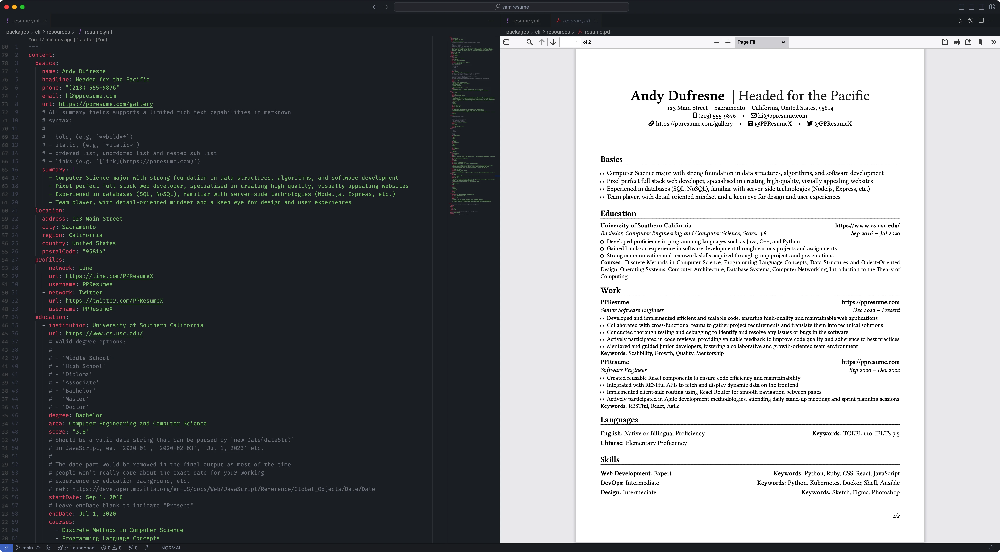
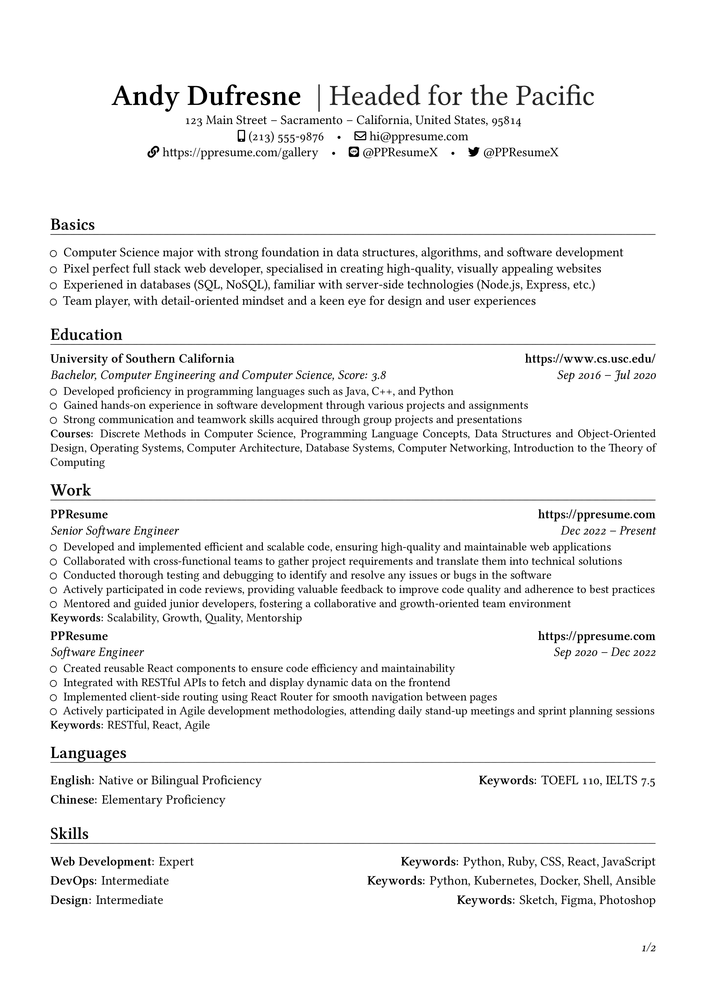
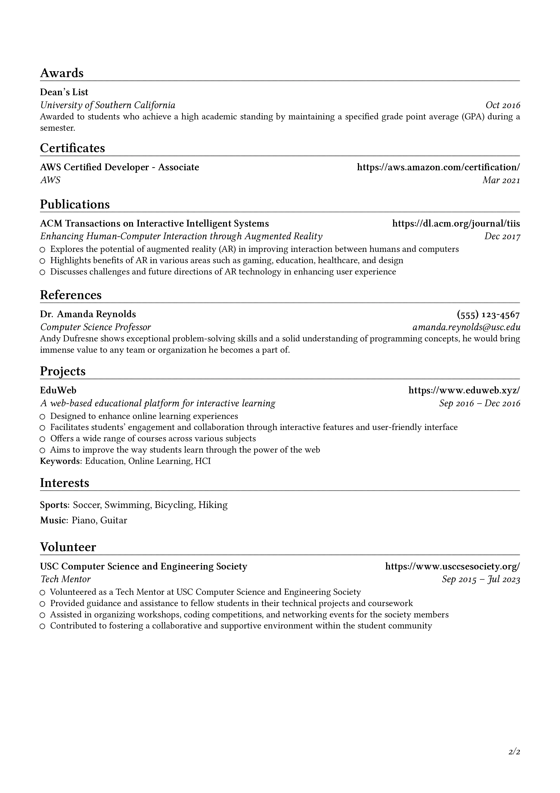

# YAMLResume

[English](../README.md) | [Français](./README-fr.md) | [Deutsch](./README-de.md) | [Español](./README-es.md) | [Português](./README-pt.md) | [Bahasa Indonesia](./README-id.md) | [日本語](./README-ja.md) | [简体中文](./README-zh-cn.md) | [繁體中文](./README-zh-tw.md)

<!-- Build, Quality & Docs -->
[](https://github.com/yamlresume/yamlresume/actions/workflows/test.yml)
[](https://codecov.io/gh/yamlresume/yamlresume)
[](https://github.com/yamlresume/yamlresume/security)
[](https://yamlresume.dev)
[](https://discord.gg/9SyT7mVV4K)

<!-- Package & Distribution -->
[](https://nodejs.org/)
[](https://www.npmjs.com/package/yamlresume)
[](https://www.npmjs.com/package/yamlresume)
[](https://hub.docker.com/r/yamlresume/yamlresume)
[](https://hub.docker.com/r/yamlresume/yamlresume)

<!-- Technology Stack -->
[](https://www.latex-project.org/)
[](https://www.typescriptlang.org/)
[](https://pnpm.io/)
[](https://conventionalcommits.org)
[](https://biomejs.dev/)
[](https://vitest.dev/)

> 📢 **Noticias:** ¡[YAMLResume GitHub
> Action](https://github.com/marketplace/actions/yamlresume) ha sido lanzado!
> Automatiza la generación del PDF de tu currículum directamente en tu pipeline CI/CD. Echa un vistazo a
> la [documentación](https://yamlresume.dev/docs/ecosystem/action) y la
> [publicación del anuncio](https://yamlresume.dev/blog/yamlresume-action).

Escribir currículums puede no ser difícil, pero definitivamente no es divertido y es tedioso.

[YAMLResume](https://yamlresume.dev) te permite gestionar y controlar la versión de tus currículums usando [YAML](https://yaml.org/) y hace que generar PDFs de aspecto profesional con una tipografía hermosa sea muy fácil.



## El Principio de Diseño

Este proyecto comenzó como el motor principal de tipografía para
[PPResume](https://ppresume.com/?ref=yamlresume), un creador de currículums basado en LaTeX. Después de considerarlo cuidadosamente, decidimos hacerlo de código abierto para que
las personas siempre tengan el derecho de decir [no al bloqueo del proveedor (vendor lock-in)](https://blog.ppresume.com/posts/no-vendor-lock-in).

El principio de diseño fundamental detrás de YAMLResume es la [Separación de Intereses](https://es.wikipedia.org/wiki/Separaci%C3%B3n_de_intereses). Uno de los
ejemplos más conocidos de este principio es HTML y CSS, que forman la base
de la web moderna. HTML define el contenido, y CSS lo estiliza.

Siguiendo este principio, diseñamos YAMLResume teniendo en cuenta los siguientes requisitos:

- el contenido del currículum se redacta en texto plano
- el texto plano está estructurado usando YAML—YAML es mejor que JSON porque es
  más legible y fácil de escribir para los humanos
- el texto plano YAML luego se renderiza en un PDF con un motor de tipografía conectable
- el diseño se puede ajustar con opciones como tamaños de fuente, márgenes de página, etc.

## Inicio Rápido

Si tienes Docker instalado, puedes comenzar con `yamlresume` en un
segundo, este paquete incluye `yamlresume` y todas sus dependencias:

[](https://asciinema.org/a/722057)

Alternativamente, puedes instalar `yamlresume` usando tu gestor de paquetes favorito:

```
# NPM
$ npm install -g yamlresume

# Yarn
$ yarn global add yamlresume

# pnpm
$ pnpm add -g yamlresume

# Bun
$ bun add -g yamlresume

# Homebrew
$ brew install yamlresume
```

Verifica que `yamlresume` se instaló correctamente:

```
$ yamlresume help
Usage: yamlresume [options] [command]

YAMLResume — Resume as Code in YAML

 __   __ _    __  __ _     ____
 \ \ / // \  |  \/  | |   |  _ \ ___  ___ _   _ ___  ___   ___
  \ V // _ \ | |\/| | |   | |_) / _ \/ __| | | / _ \/ _ \ / _ \
   | |/ ___ \| |  | | |___|  _ <  __/\__ \ |_| | | | | | |  __/
   |_/_/   \_\_|  |_|_____|_| \_\___||___/\____|_| |_| |_|\___|


Options:
  -V, --version                  output the version number
  -v, --verbose                  verbose output
  -h, --help                     display help for command

Commands:
  new [filename]                 create a new resume
  build [options] <resume-path>  build a resume to LaTeX and PDF
  dev [options] <resume-path>    build a resume on file changes (watch mode)
  languages                      i18n and l10n support
  templates                      manage resume templates
  validate <resume-path>         validate a resume against the YAMLResume schema
  help [command]                 display help for command
```

Luego debes instalar un motor de tipografía, ya sea
[XeTeX](http://yamlresume.dev/docs#install-typesetting-engine) o
[Tectonic](http://yamlresume.dev/docs#install-typesetting-engine) para poder generar los PDFs.

Por último, pero no menos importante, recomendamos instalar la fuente [Linux
Libertine](http://yamlresume.dev/docs#linux-libertine-font) para obtener PDFs con mejor apariencia.

Consulta nuestra [guía de instalación](http://yamlresume.dev/docs/installation) para más detalles.

## Crear un nuevo currículum

Puedes crear tu propio currículum clonando uno de nuestros ejemplos
[aquí](../packages/cli/src/commands/fixtures/software-engineer.yml). Una vez que tengas el de ejemplo en tu equipo, puedes generar el PDF:

```
$ yamlresume new my-resume.yml
✔ Created my-resume.yml successfully.

$ yamlresume build my-resume.yml
✔ Generated resume tex file successfully: my-resume.tex
◐ Generating resume pdf file with command: xelatex -halt-on-error my-resume.tex...
✔ Generated resume pdf file successfully: my-resume.pdf
✔ Generated resume markdown file successfully: my-resume.md
✔ Generated resume html file successfully: my-resume.html
```

También puedes usar el [comando `dev`](https://yamlresume.dev/docs/cli#dev) para
reconstruir el currículum en cada cambio de archivo, lo cual brinda **una experiencia similar al desarrollo web moderno**:

```
$ yamlresume dev my-resume.yml
✔ Generated resume tex file successfully: my-resume.tex
◐ Generating resume pdf file with command: xelatex -halt-on-error my-resume.tex...
◐ Watching file changes: my-resume.yml...
✔ Generated resume pdf file successfully: my-resume.pdf
✔ Generated resume markdown file successfully: my-resume.md
```

Puedes ver el PDF generado [aquí](../docs/static/images/resume.pdf).




La [Galería de PPResume](https://ppresume.com/gallery/?ref=yamlresume) muestra ejemplos de currículums clasificados por idiomas y plantillas.

## Validar currículums

YAMLResume provee un
[esquema (schema)](https://yamlresume.dev/docs/compiler/schema) incorporado que puedes usar para
validar los currículums y evitar errores menores antes de construirlos.

## Tipografía

YAMLResume utiliza [LaTeX](https://www.latex-project.org/) como su motor de tipografía por defecto, el cual es el sistema de tipografía más avanzado en la industria de la publicación.

También soporta [motores de diseño basados en HTML/CSS](https://yamlresume.dev/docs/layouts/html), lo que te permite producir currículums amigables con la web.

Al seguir una serie de [mejores prácticas](https://docs.ppresume.com/guide?ref=yamlresume), YAMLResume siempre garantiza currículums de píxeles perfectos (**Pixel Perfect**).

## Ecosistema

YAMLResume ofrece un conjunto de herramientas para ayudarte a crear, convertir y gestionar tus
currículums más eficientemente:

- [@yamlresume/playground](https://www.npmjs.com/package/@yamlresume/playground) es un componente React para construir tu propio editor de currículums. Impulsa el [Playground](https://yamlresume.dev/playground) oficial.
- [create-yamlresume](https://yamlresume.dev/docs/ecosystem/create-yamlresume)
  facilita iniciar un proyecto nuevo YAMLResume con un comando.
- [json2yamlresume](https://yamlresume.dev/docs/ecosystem/json2yamlresume) es una
  herramienta CLI para convertir archivos de [JSON Resume](https://jsonresume.org/) al formato nativo.

## Contribuir

Este proyecto aún está bajo desarrollo activo. ¡Las contribuciones son profundamente apreciadas! Por favor lee la [guía de contribución](../CONTRIBUTING.md) antes de enviar un pull request.

### Historial de Estrellas

[](https://www.star-history.com/#yamlresume/yamlresume&Date)

## Soporta el Proyecto

Si encuentras útil a YAMLResume, por favor considera apoyar el proyecto:

[](https://buymeacoffee.com/xiaohanyu)
