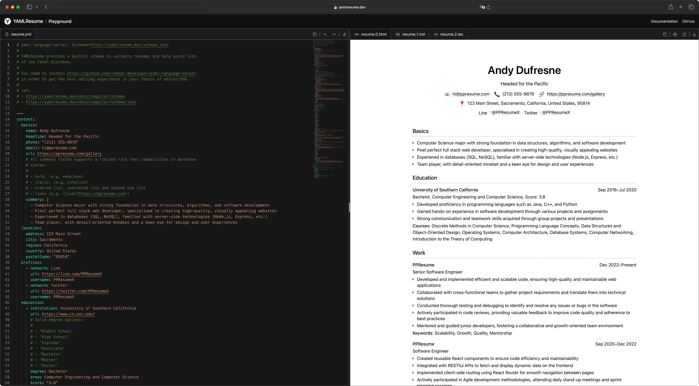
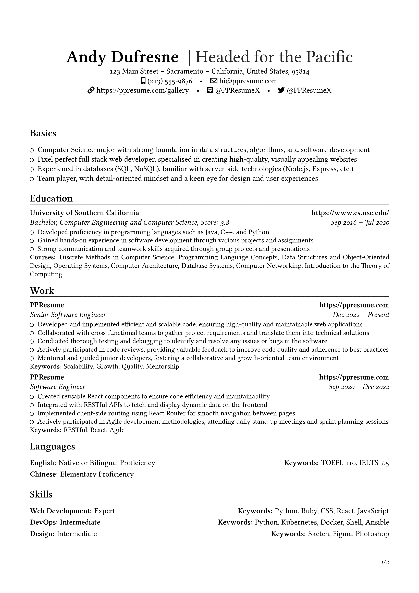
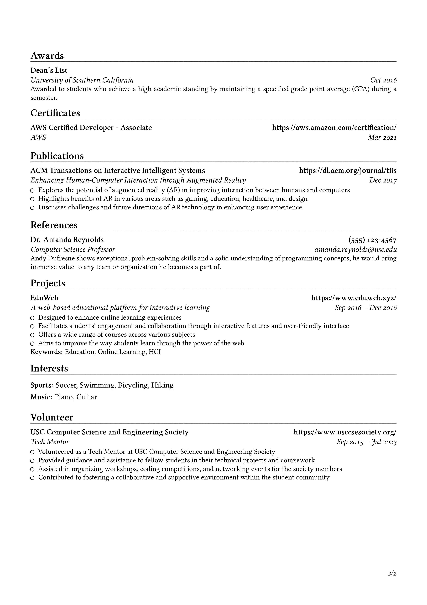
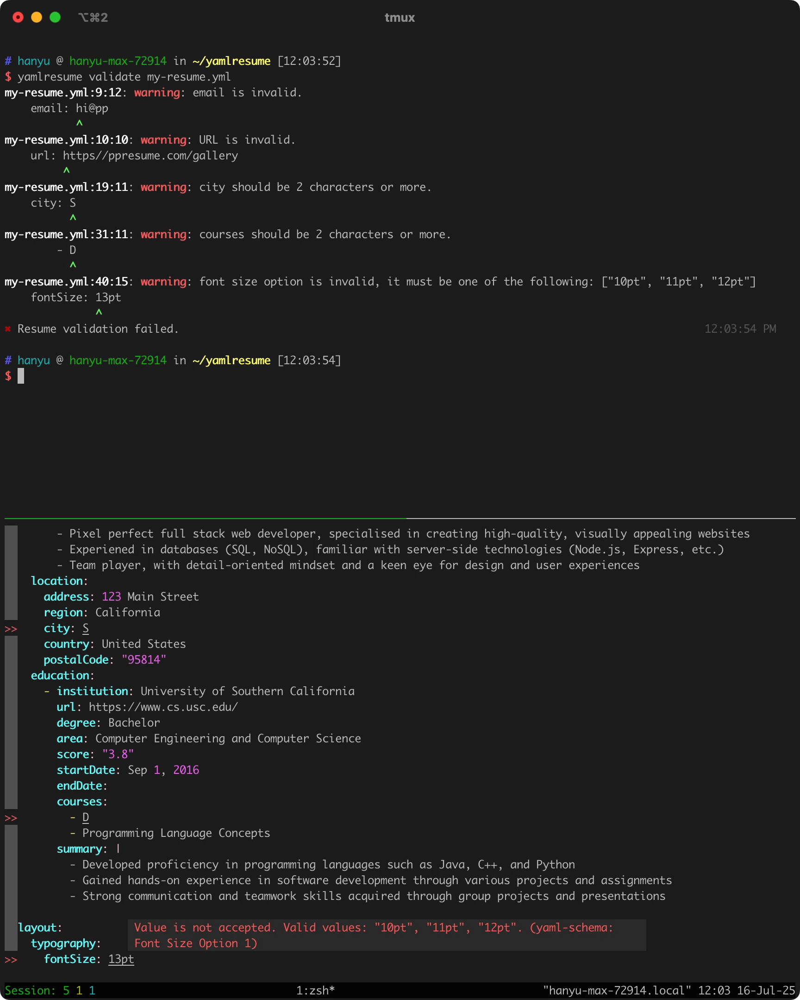
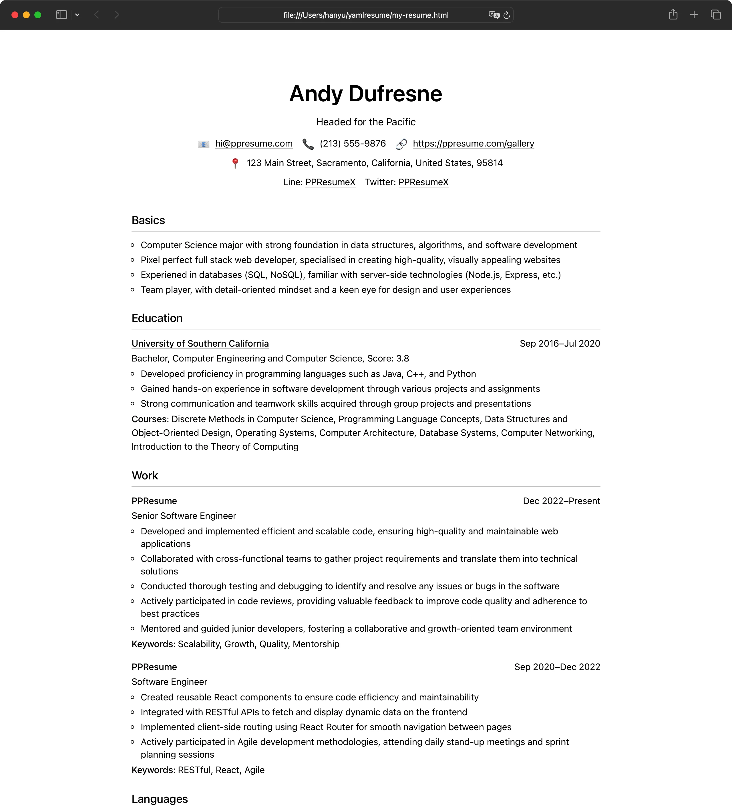
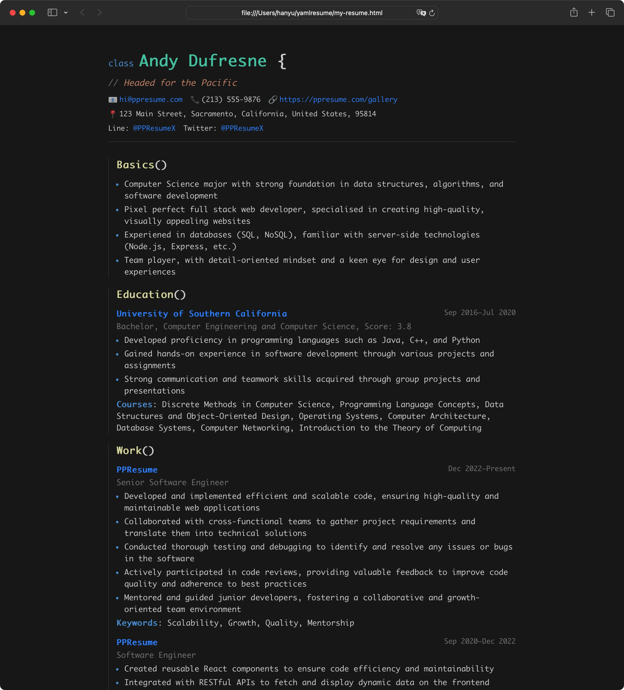
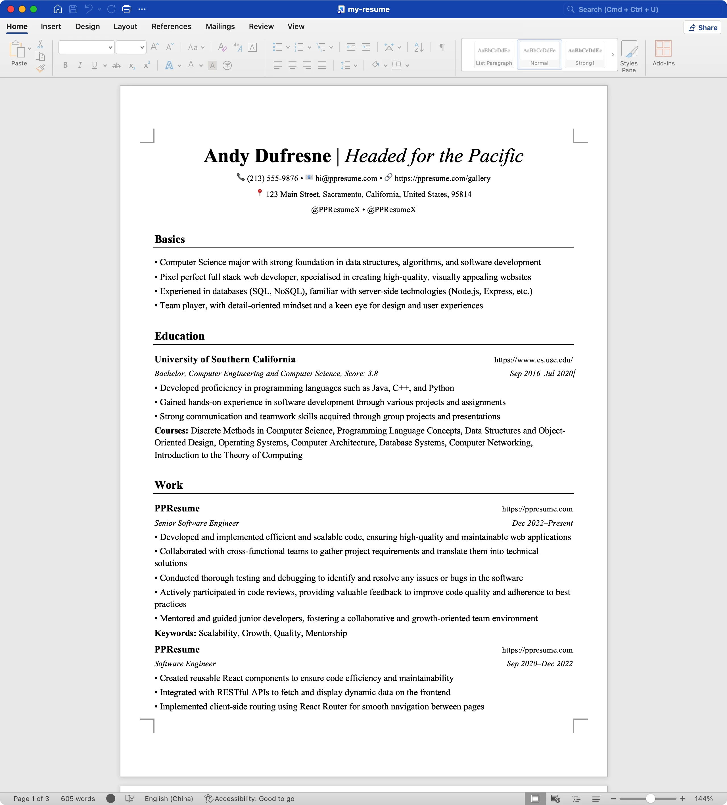

# YAMLResume

[English](../README.md) | [Français](./README-fr.md) | [Deutsch](./README-de.md) | [Español](./README-es.md) | [Português](./README-pt.md) | [Bahasa Indonesia](./README-id.md) | [日本語](./README-ja.md) | [简体中文](./README-zh-cn.md) | [繁體中文](./README-zh-tw.md)

<!-- Build, Quality & Docs -->

[](https://github.com/yamlresume/yamlresume/actions/workflows/test.yml)
[](https://yamlresume.dev)
[](https://discord.gg/9SyT7mVV4K)
[](https://codecov.io/gh/yamlresume/yamlresume)
[](https://github.com/yamlresume/yamlresume/security)
[](https://debuggix.space/verified)

<!-- Package & Distribution -->

[](https://nodejs.org/)
[](https://www.npmjs.com/package/yamlresume)
[](https://www.npmjs.com/package/yamlresume)
[](https://hub.docker.com/r/yamlresume/yamlresume)
[](https://hub.docker.com/r/yamlresume/yamlresume)

<!-- Technology Stack -->

[](https://www.latex-project.org/)
[](https://www.typescriptlang.org/)
[](https://pnpm.io/)
[](https://conventionalcommits.org)
[](https://biomejs.dev/)
[](https://vitest.dev/)

> **Novidades:**
> [YAMLResume v0.15](https://github.com/yamlresume/yamlresume/releases) foi
> lançado com currículos de exemplo selecionados para 12 idiomas e geração de
> currículo assistida por IA. Confira também a
> [GitHub Action YAMLResume](https://github.com/marketplace/actions/yamlresume)
> para automatizar a geração de PDF em CI/CD.

Escrever um currículo pode não ser difícil, mas definitivamente não é divertido
e é trabalhoso.

[YAMLResume](https://yamlresume.dev) permite que você gerencie e faça version
control dos seus currículos em [YAML](https://yaml.org/) texto puro e os
transforme em documentos profissionais, perfeitamente compostos, com um único
comando.



## Princípio de Design

Este projeto começou como o motor de composição tipográfica base para o
[PPResume](https://ppresume.com/?ref=yamlresume), um gerador de currículo baseado
em LaTeX com precisão de pixel. Após consideração cuidadosa, decidimos torná-lo
open source para que todos sempre possam
[dizer não ao vendor lock-in](https://blog.ppresume.com/posts/no-vendor-lock-in).

O YAMLResume segue o princípio de
[separação de responsabilidades](https://pt.wikipedia.org/wiki/Separa%C3%A7%C3%A3o_de_responsabilidades):

- **Conteúdo** é armazenado em YAML texto puro.
- **Estrutura e validação** são impostas pelo compilador e um esquema rígido.
- **Apresentação** é tratada por motores de layout intercambiáveis (LaTeX, HTML,
  Markdown, DOCX).

Você edita o quê; o YAMLResume cuida do como.

## Funcionalidades em Resumo

- **Uma fonte, múltiplas saídas.** A partir de um único `resume.yml`, gere PDFs
  com precisão de pixel (via LaTeX), Markdown limpo, HTML responsivo e arquivos
  Microsoft Word DOCX.
- **Um compilador de currículo real.** Análise, validação, transformação e
  renderização. Detecte erros cedo com validação em tempo de execução via Zod e
  integração de esquema JSON Schema no editor.
- **Excelente experiência de desenvolvimento.** Modo watch com `yamlresume dev`,
  diagnóstico de ambiente com `yamlresume doctor` e validação instantânea de
  esquema.
- **Geração assistida por IA.** Crie um currículo completo a partir de um cargo
  e um idioma com `yamlresume ai generate`.
- **Layouts flexíveis.** Renomeie e reorganize seções, troque modelos, ajuste
  tipografia, formato de papel, espaçamento de linhas e ative/desative ícones.
- **i18n completo.** Suporte nativo para 10 idiomas em 12 códigos de locale.
- **Ecossistema rico.** Imagem Docker, fórmula Homebrew, GitHub Action,
  Playground incorporável, exemplos selecionados e conversor JSON Resume.

## Início Rápido

A maneira mais rápida de experimentar o YAMLResume é com Docker. A imagem
inclui a CLI, XeTeX e as fontes recomendadas:

```sh
docker run --rm -v $(pwd):/home/yamlresume yamlresume/yamlresume new my-resume.yml
docker run --rm -v $(pwd):/home/yamlresume yamlresume/yamlresume build my-resume.yml
```

[](https://asciinema.org/a/722057)

Você também pode instalar `yamlresume` com seu gerenciador de pacotes favorito
(Node.js >= 22 é necessário):

```sh
# npm
npm install -g yamlresume

# pnpm
pnpm add -g yamlresume

# yarn
yarn global add yamlresume

# bun
bun add -g yamlresume

# Homebrew (macOS)
brew install yamlresume
```

Verifique a instalação e seu ambiente:

```sh
yamlresume help
yamlresume doctor
```

Para etapas detalhadas de instalação, incluindo a configuração de um motor de
composição tipográfica, consulte o
[guia de instalação](https://yamlresume.dev/docs/installation).

## Criando um Novo Currículo

Você pode criar seu próprio currículo clonando um dos nossos exemplos
[aqui](../packages/cli/src/commands/fixtures/software-engineer.yml). Uma vez
que o exemplo está em seu computador, você pode gerar um PDF com:

```sh
$ yamlresume new my-resume.yml
✔ Created my-resume.yml successfully.

$ yamlresume build my-resume.yml
✔ Generated resume tex file successfully: my-resume.tex
◐ Generating resume pdf file with command: xelatex -halt-on-error my-resume.tex...
✔ Generated resume pdf file successfully: my-resume.pdf
✔ Generated resume docx file successfully: my-resume.docx
✔ Generated resume markdown file successfully: my-resume.md
✔ Generated resume html file successfully: my-resume.html
```

Você também pode usar o
[comando `dev`](https://yamlresume.dev/docs/cli#dev) para reconstruir seu
currículo sempre que o arquivo mudar, o que proporciona **uma experiência como
desenvolvimento web moderno**:

```sh
$ yamlresume dev my-resume.yml
✔ Generated resume tex file successfully: my-resume.tex
◐ Generating resume pdf file with command: xelatex -halt-on-error my-resume.tex...
◐ Watching file changes: my-resume.yml...
✔ Generated resume pdf file successfully: my-resume.pdf
✔ Generated resume docx file successfully: my-resume.docx
✔ Generated resume markdown file successfully: my-resume.md
```

Confira o PDF gerado [aqui](../docs/static/images/resume.pdf).




A [PPResume Gallery](https://ppresume.com/gallery/?ref=yamlresume) apresenta
uma visão geral de todos os tipos de currículos possíveis, classificados por
idiomas e modelos.

## Saídas Multi-Layout

Layouts separam seu conteúdo da apresentação. Adicione tantos formatos de saída
quanto necessário em `resume.yml`:

```yml
layouts:
  - engine: latex
    template: moderncv-banking
    typography:
      fontSize: 11pt
  - engine: markdown
  - engine: html
    template: calm
  - engine: docx
    template: calm
```

Saiba mais sobre cada motor:

- [LaTeX / PDF](https://yamlresume.dev/docs/layouts/latex)
- [HTML](https://yamlresume.dev/docs/layouts/html)
- [Markdown](https://yamlresume.dev/docs/layouts/markdown)
- [DOCX](https://yamlresume.dev/docs/layouts/docx)

## Modo Watch

Use `yamlresume dev` para reconstruir automaticamente seu currículo sempre que o
arquivo YAML for editado:

```sh
yamlresume dev my-resume.yml
```

Isso lhe dá um loop de feedback rápido semelhante ao desenvolvimento web moderno:
salve o arquivo e o PDF será atualizado momentos depois. Você pode passar
`--no-pdf` ou `--no-validate` para economizar tempo durante o rascunho.

## Validando Currículos

O YAMLResume fornece um
[esquema](https://yamlresume.dev/docs/compiler/schema) embutido que valida seu
currículo antes da renderização. Adicione o cabeçalho do esquema ao seu arquivo
YAML para obter auto-completação no IDE, documentação ao passar o mouse e
verificações de formato em tempo real:

```yml
# yaml-language-server: $schema=https://yamlresume.dev/schema.json
```

Execute `yamlresume validate my-resume.yml` para diagnósticos no estilo clang:



## Geração de Currículo Assistida por IA

Novo na v0.14, `yamlresume ai generate` cria um currículo completo e compatível
com o esquema a partir de um cargo e idioma:

```sh
export OPENAI_API_KEY=sk-...
yamlresume ai generate --position "Software Engineer" --language en resume.yml
```

Os provedores suportados incluem OpenAI, DeepSeek, Kimi e Ollama. Consulte a
[documentação de IA](https://yamlresume.dev/docs/ai) para detalhes de
configuração.

## Modelos

O YAMLResume vem com uma coleção crescente de modelos para vários motores:

| Motor  | Modelos                                                          |
| ------ | ---------------------------------------------------------------- |
| LaTeX  | `moderncv-banking`, `moderncv-casual`, `moderncv-classic`, `jake` |
| HTML   | `calm`, `vscode`                                                 |
| DOCX   | `calm`                                                           |

Execute `yamlresume templates list` para ver todos os modelos instalados.





## Idiomas

O YAMLResume suporta localização nativamente. Defina seu locale em `resume.yml`:

```yml
locale:
  language: en
```

Os idiomas suportados incluem inglês, chinês (simplificado, tradicional TW/HK),
espanhol, francês, norueguês, holandês, japonês, alemão, indonésio e português
brasileiro. Consulte a
[documentação de Locale](https://yamlresume.dev/docs/locale) para a lista
completa.

## Ecossistema

O YAMLResume fornece um conjunto de ferramentas para ajudá-lo a criar, converter
e gerenciar currículos com mais eficiência:

- [`@yamlresume/ai`](https://www.npmjs.com/package/@yamlresume/ai) — Geração de
  currículo assistida por IA, programática.
- [`@yamlresume/playground`](https://www.npmjs.com/package/@yamlresume/playground)
  — Componente React incorporável para criar seu próprio editor de currículo.
  Alimenta o [Playground](https://yamlresume.dev/playground) oficial.
- [`@yamlresume/samples`](https://www.npmjs.com/package/@yamlresume/samples) —
  Currículos de exemplo selecionados para cargos comuns em 12 idiomas.
- [`yamlresume/action`](https://github.com/marketplace/actions/yamlresume) —
  GitHub Action para automatizar a geração de currículos em CI/CD.
- [`create-yamlresume`](https://yamlresume.dev/docs/ecosystem/create-yamlresume)
  — Crie um novo projeto YAMLResume com um único comando.
- [`json2yamlresume`](https://yamlresume.dev/docs/ecosystem/json2yamlresume) —
  Converta arquivos [JSON Resume](https://jsonresume.org/) para o formato
  YAMLResume.
- [Imagem Docker](https://hub.docker.com/r/yamlresume/yamlresume) e
  [fórmula Homebrew](https://formulae.brew.sh/formula/yamlresume) para
  instalação fácil.

## Contribuindo

O YAMLResume está em desenvolvimento ativo e novas funcionalidades são adicionadas
regularmente. Contribuições são extremamente bem-vindas! Por favor, leia as
[diretrizes](../CONTRIBUTING.md) antes de enviar um pull request.

### Histórico de Estrelas

[](https://star-history.dera.page/#yamlresume/yamlresume&Date)

## Roadmap

- [ ] mais modelos de currículo
- [ ] mais motores de layout (typst, e outros)
- [ ] mais idiomas e locales
- [ ] funcionalidades de otimização para ATS

## Apoie o Projeto

Se o YAMLResume é útil para você, considere apoiar o projeto:

[](https://buymeacoffee.com/xiaohanyu)
